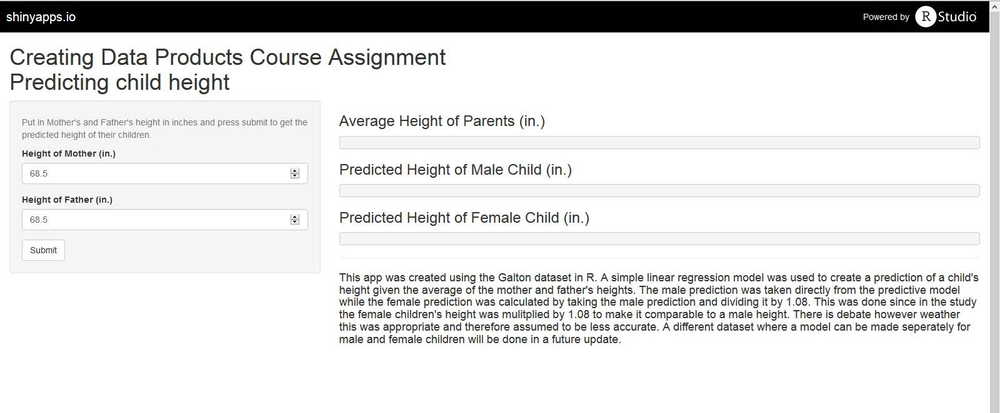

Predicting Child's Height App
========================================================
author: Amanda Carnicello 
date: 06/20/15

Overview
========================================================

This app was made to predict the height of a child given the average height of the parents. The Galton dataset in R was used to create a simple linear model to predict the height.    

It can be acessed at https://acarnicello.shinyapps.io/CreatingDataProductsShinyApp

Use
========================================================

All the user needs to do is put in the heights of the parents in the respective boxes and press submit.  The app will then display the average heights of the pareents with the predicted heights.

Test of model on test set
========================================================

***
#### This plot shows the predicitve values of the regression model obtained by a testing set shown in the blue line versus the actual children's heights in the testing set in open black circles.  Visually the regression looks resonably close to the center of the obsverved data points so the predictive values of the user inupts would be in that range as well.

Potential Concerns and Future Updates
========================================================

There are two main concerns that are apprent by using this dataset and will be addressed in future updates.

1. The dataset only contained the parential average and did not have any other predictors to use.
  + If you look at the chart before you can see there is alot of deviation just looking at the parential height. Using other factors would make a more accurate prediction.
    
2. The heights of the female children were multiplied by 1.08 to make them comaparable to the male children' height
  + The heights of the two groups should be kept seperate and gender should be used as a predictor to make a more accurate model
    
